.. _tutorial:

Tutorial
========

In current version, `kotti_mapreduce` uses only Amazon Elastic MapReduce
(Amazon EMR). Let's make a streaming job flow.

Job Container
-------------

First of all, create a Job Container.

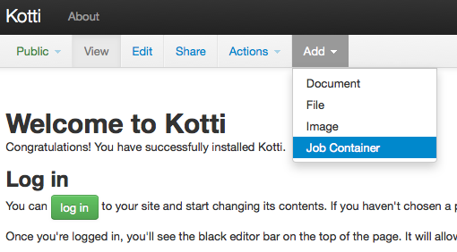

    Add Job Container

You can see an Edit page for Job Container. Then, input for a title
what you like and click `save` button. Sorry, `Cloud vendor` is
only accepted `aws`.

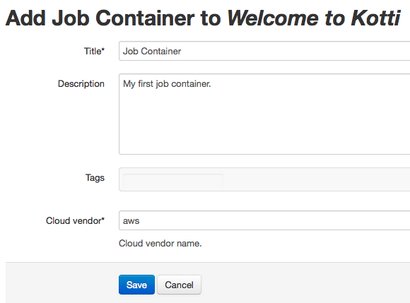

    Create Job Container

A Job Container content is created. You can see :ref:`resource` and
:ref:`bootstrap` and :ref:`jobservice` sections.

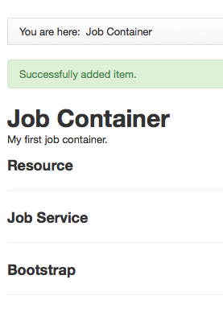

    Created Job Container

.. _resource:

Resource
--------

You have to register an AWS settings at least one.

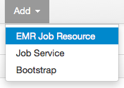

    Add EMR Job Resource

.. _bootstrap:

Bootstrap
---------

As necessary, you can register Hadoop bootstrap processes.

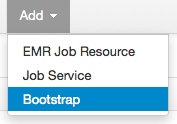

    Add Bootstrap

Select `Action Type` and input other parameters. For example,
`Configure Daemons` is below.

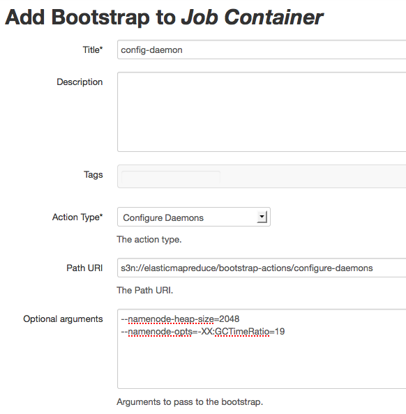

    Create Bootstrap

.. _jobservice:

Job Service
-----------

Now, you're ready to create the EMR Job Flow. Before creating a job flow,
make a job service to be able to include several job flows.
The job service is used as a container for jobflows.

.. figure:: _static/k7.png
    :alt: Add Job Service
    :align: center

    Add Job Service

Select :ref:`resource` to be used on this job service.

.. note::

    Job Service requires a resource so you have to register
    the resource at least one.

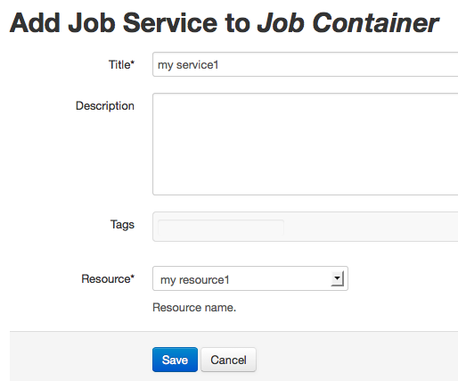

    Create Job Service

After saving a job service, you can see below page.

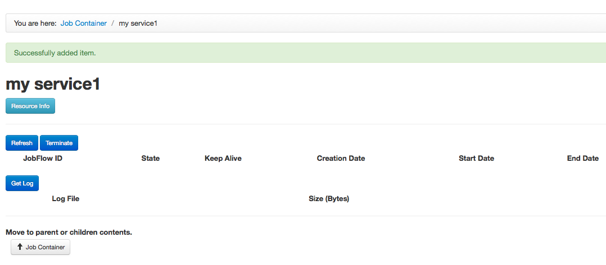

    Created Job Service

.. _jobflow:

Job Flow
--------

Let's keep trying a little longer. We believe you already get used to
Kotti user interface. Take it easy!

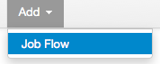

    Add Job Flow

`Job type` is important configuration to select Hadoop application.
There three applications as below.

* hive
* custom-jar
* streaming

If your application requires bootstrap processes, set them as the
job flow's configuration. For example, `Streaming Job` is below.

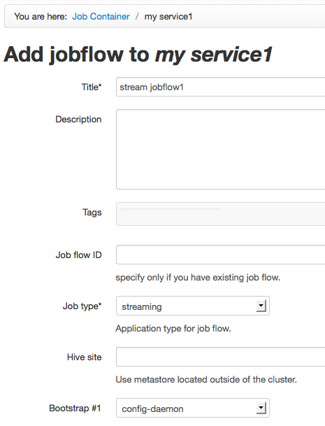

    Create Job Flow

.. _jobstep:

Job Step
--------

This is last task. Add several steps to a job flow.

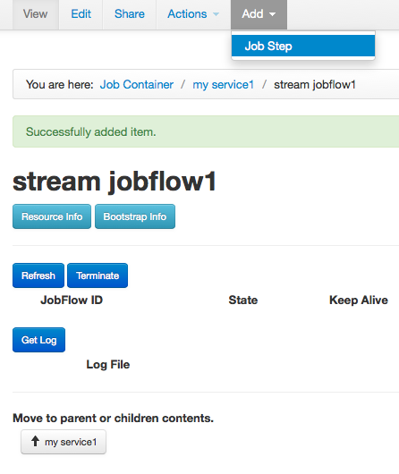

    Add Job Step

This step is a `Word Count Example`_.

.. _Word Count Example: http://aws.amazon.com/articles/2273

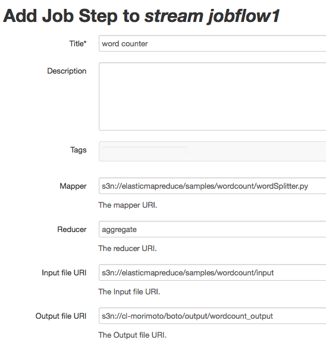

    Create Job Step

Back to upper job flow after you created a job step.

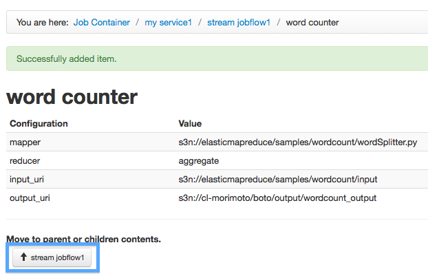

    Created Job Step

You can see a `Run Jobflow` button. It means all settings are completed.

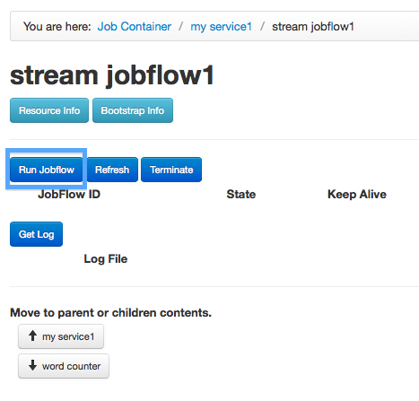

    Run Job Flow

Click `Run Jobflow` button, then you'll see the job flow's information.
To show latest information, click `Refresh` button.

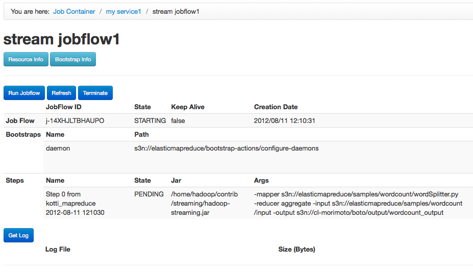

    View Job Flow Status

Get Log
-------

Your job flow is finished, then you can get the logs. The log is located
on `Log URI` of ref:`resource`. To get download each log file,
click an icon next to its log file name.

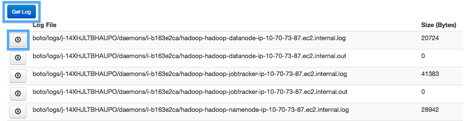

    Get Log from S3
